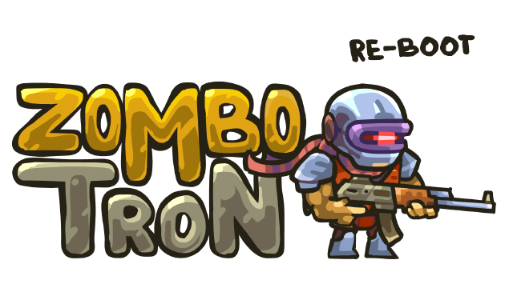

<div align=center>



</div>
<h1 align=center>Zombotron Re-Boot — Nintendo Switch port (Unity 6000.2.6f2)</h1>

A wrapper/port of the Android release of Zombotron Re-Boot. 

It loads the original game binaries (`libmain.so`, `libunity.so`, `libil2cpp.so`, `lib_burst_generated.so`); resolves their imports
against native Switch implementations and
patches them so the game runs inside a minimal Android environment.

> [!NOTE]
I suggest use the Google Play version. I think it's more updated than the itch.io version

## How to install

Create a folder for the game on your SD card, `/switch/zombotron_nx/`, and place:

1. `zombotron_nx.nro`.
2. The `.so` libraries and the `assets` folder from the Zombotron Re-Boot 
   APK. Open the APK with 7-Zip or another ZIP extractor: copy the libraries out
   of `lib/arm64-v8a/` into the folder and **copy the whole `assets/` folder.**

```text
/switch/zombotron_nx/
  zombotron_nx.nro
  libmain.so
  libunity.so
  libil2cpp.so
  lib_burst_generated.so
  assets/
    bin/Data/ ...             (data.unity3d, boot.config, global-metadata.dat)
    aa/ ...                   (Addressables catalog + bundles)
```

The four `.so` files can sit next to the `.nro` (as above) **or** grouped inside a
`lib/` subfolder (`/switch/zombotron_nx/lib/libmain.so`, and so on) if you prefer a
tidier root — the loader checks both locations. Zombotron Re-Boot ships most of its
content through addressables, so **copy the entire `assets/` folder**,
not just `bin/Data`.

Your `zombotron_nx` folder should look like this:

https://github.com/user-attachments/assets/f302b914-aed2-475a-b779-7342fc934809

Launch with a game override (hold **R** while starting an installed title) or a
forwarder. Album applet mode does not provide enough memory or the required
code-memory permissions. If you use a forwarder, set it to a **39-bit address
space** — a 36-bit one runs out of address room during loading and crashes.

> [!NOTE]
I suggest use the latest version of [Sphaira](https://github.com/NaGaa95/sphaira) to generate the forwarder. 

Finally **CHECK [THIS SCREENSHOT](https://i.imgur.com/W4hpDcY.jpeg)** to know which options you must use to generate the forwarder.

## Controls

The full Switch controller is handed to the game. Input is gamepad-only — the
touchscreen, gyro and stick-cursor are disabled.

| Input | Action |
| --- | --- |
| Left stick / D-pad | Move |
| Right stick | Aim |
| ZL | Jump |
| ZR | Shoot |
| X | Reload |
| L | Previous weapon |
| R | Next weapon |
| A | Confirm / Interact |
| B | Close the Pause Menu |
| + | Open Pause Menu |

Jump and Fire sit on the **ZL / ZR** triggers because that is where the game
puts them; the on-screen prompts still show LT / RT. Menus are navigated with the stick and confirmed with **A**.

> [!WARNING]
Closing submenus or going back by pressing the B button isn't working right now.

## Resolution

Both handheld and docked render at **1280x720**. In handheld that is the native
panel resolution; in docked the Switch compositor upscales the 720p image to the
1080p output.

Check **the REASON [IN THIS PR](https://github.com/StevensND/zombotron_nx/pull/1)**

## Build

devkitA64 plus these portlibs:

```sh
dkp-pacman -S switch-mesa switch-libdrm_nouveau switch-sdl2 switch-zlib switch-libpng
```

Then `make` from a devkitPro shell.

A GitHub Actions workflow (`.github/workflows/build.yml`) is also included: it
builds the `.nro` on every push using the `devkitpro/devkita64` image and can
publish it as a release on manual dispatch.

## Credits

- **AntKarlov** — creator of Zombotron Re-Boot. This is an unofficial, fan-made
  port with no affiliation.
- **[ChanseyIsTheBest](https://github.com/ChanseyIsTheBest/)** — for the help making the port.
- **TheOfficialFloW & Andy Nguyen** — the original Android so-loader.
- **fgsfds** — the Switch so-loader groundwork reused here.

## Support

**[HERE](https://linktr.ee/stevensmods)** are my social media

If you enjoy my work and want to support me :

[](https://ko-fi.com/stevenss)

## Legal

No affiliation with AntKarlov. "Zombotron" is a trademark of its owner. This
repository contains no assets or program code from the original game, and none
may be distributed with builds. Users must extract the required files from their
own legally obtained copy. Running homebrew requires custom firmware, which
violates Nintendo's ToS and can get a console banned — your call.

Source code is provided under the MIT License (see LICENSE).
